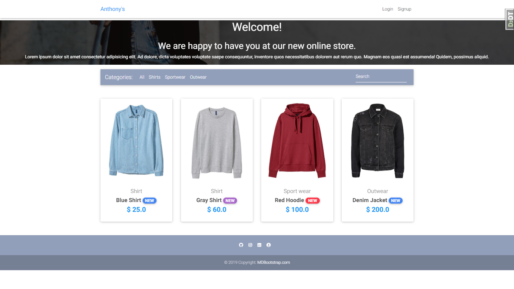
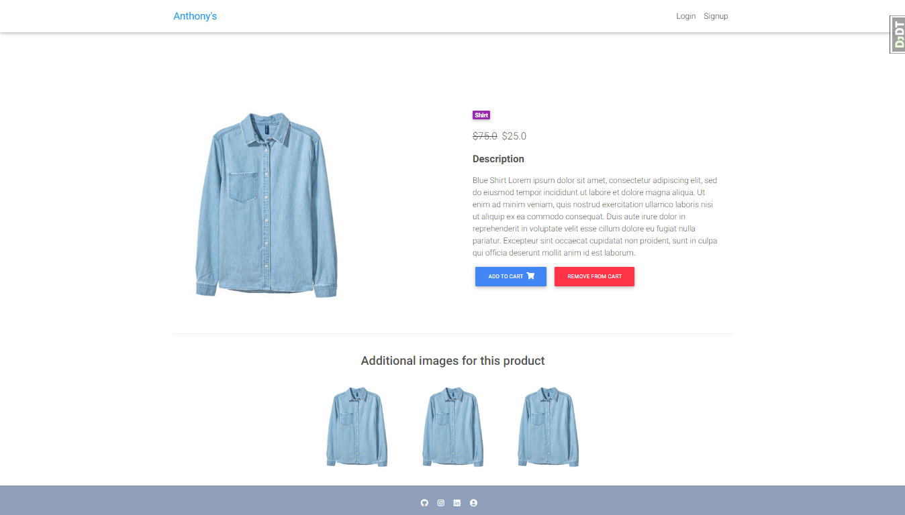
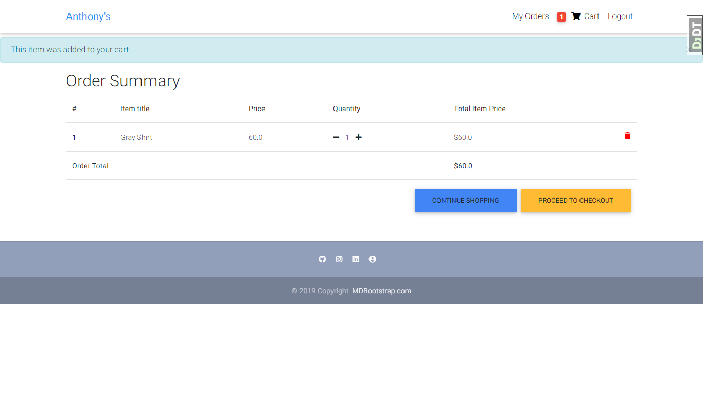
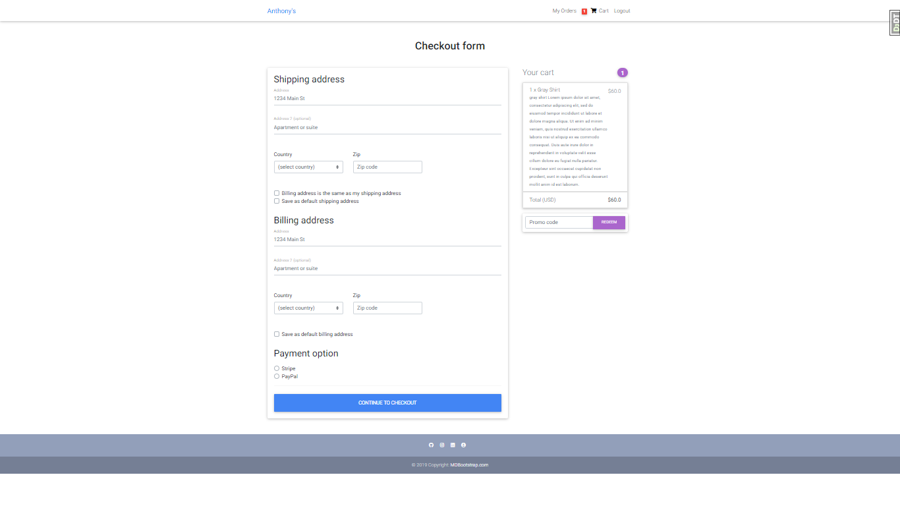
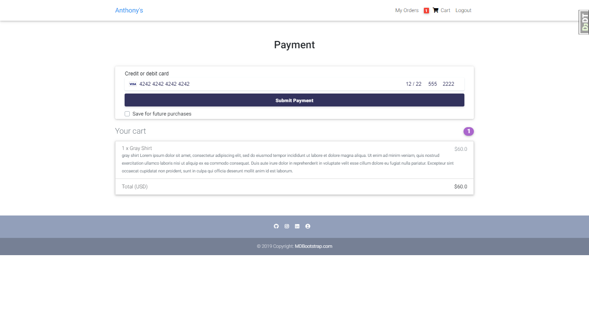
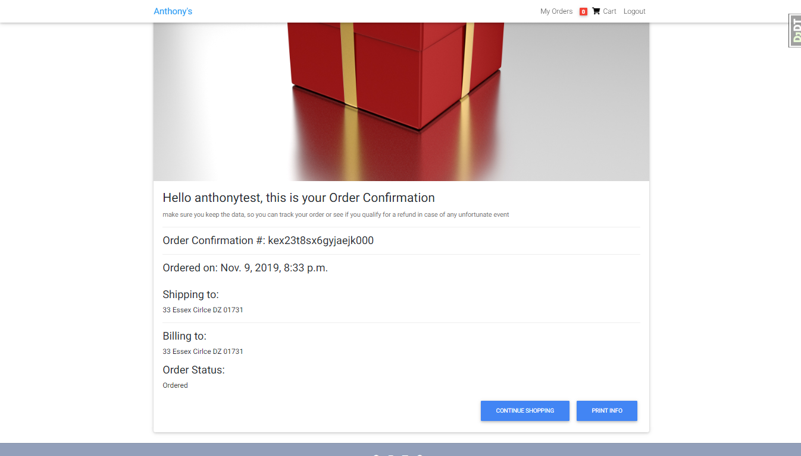
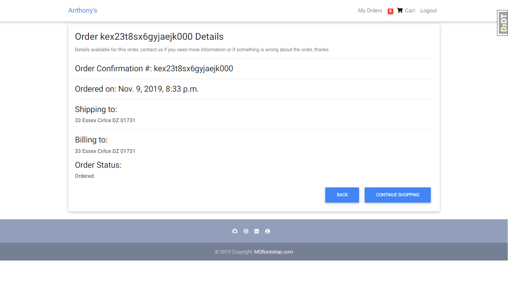
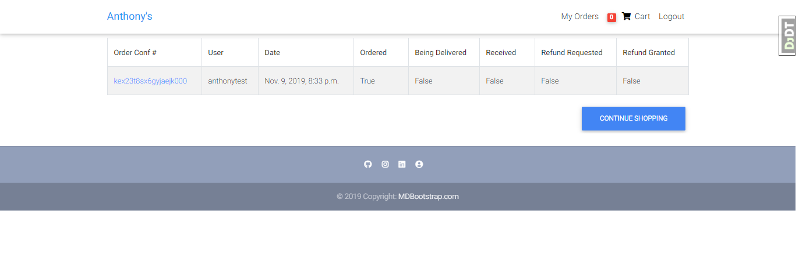
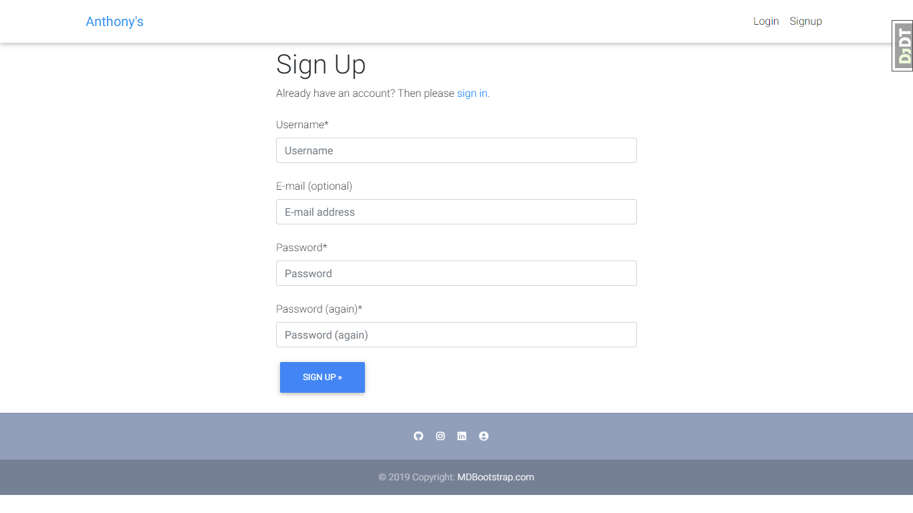

# Django2 eCommerce
Built upon a JustDjango tutorial

The requirements listed are the ones I used at the time. Update the dependencies to prevent vulnerabilities
#
## Some of the Technologies used are:
* Python
* Django
* Stripe API
* HTML/CSS/JS
* Bootstrap

#
Home

Product

Order Summary

Checkout

StripePayment

Order Confirmation

Order Details

All Orders

Sign Up 

